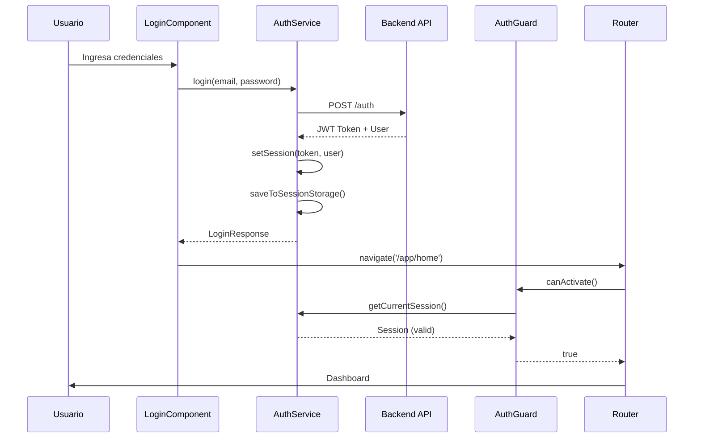
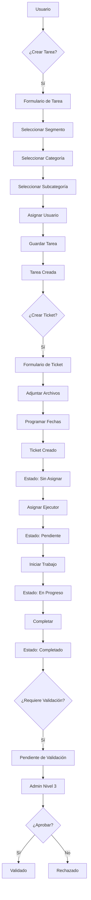
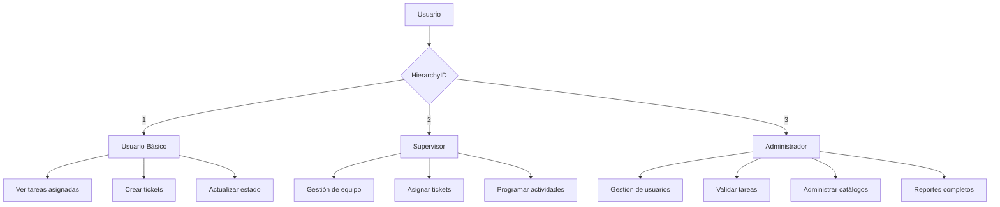
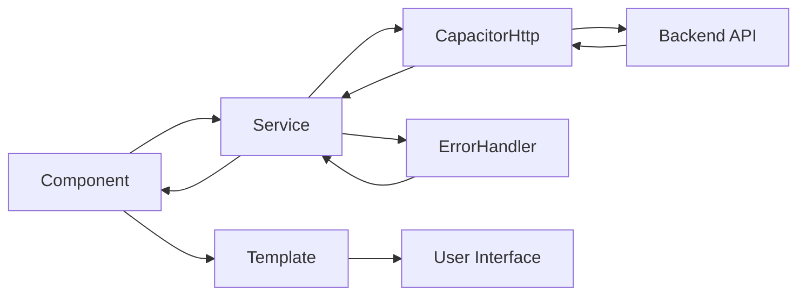

# Arquitectura Técnica del Sistema

## 🏗️ Diagrama de Arquitectura General

```
┌─────────────────────────────────────────────────────────────┐
│                    FRONTEND (Angular + Ionic)               │
├─────────────────────────────────────────────────────────────┤
│  ┌─────────────┐  ┌─────────────┐  ┌─────────────┐         │
│  │   Pages     │  │ Components  │  │  Services   │         │
│  │             │  │             │  │             │         │
│  │ • Dashboard │  │ • Menu      │  │ • Auth      │         │
│  │ • Tasks     │  │ • Layout    │  │ • Tasks     │         │
│  │ • Tickets   │  │ • UI        │  │ • Tickets   │         │
│  │ • Users     │  │             │  │ • Catalog   │         │
│  │ • Catalogs  │  │             │  │ • Users     │         │
│  └─────────────┘  └─────────────┘  └─────────────┘         │
├─────────────────────────────────────────────────────────────┤
│                    CAPACITOR BRIDGE                         │
├─────────────────────────────────────────────────────────────┤
│                    BACKEND API                              │
│  ┌─────────────┐  ┌─────────────┐  ┌─────────────┐         │
│  │   Auth      │  │   Tasks     │  │  Catalogs   │         │
│  │             │  │             │  │             │         │
│  │ • Login     │  │ • CRUD      │  │ • Segments  │         │
│  │ • JWT       │  │ • Tickets   │  │ • Categories│         │
│  │ • Users     │  │ • Files     │  │ • Concepts  │         │
│  └─────────────┘  └─────────────┘  └─────────────┘         │
└─────────────────────────────────────────────────────────────┘
```

## 🔄 Flujo de Autenticación



## 📊 Flujo de Gestión de Tareas



## 🎯 Jerarquías y Permisos



## 🏛️ Estructura de Componentes

```
LayoutComponent
├── MenuComponent
│   ├── UserAvatarComponent
│   ├── ToolsBarComponent
│   └── ButtonMenuComponent
├── Router Outlet
│   ├── DashboardComponent
│   ├── AllTasksComponent
│   ├── TicketsComponent
│   ├── TaskValuationComponent
│   ├── UsersComponent
│   └── CatalogsComponent
└── NotificationsDialog
```

## 🔧 Patrón de Servicios

```typescript
// Patrón Service Layer
@Injectable({
    providedIn: 'root'
})
export class ExampleService {
    private dataSubject = new BehaviorSubject<any[]>([]);
    public data$ = this.dataSubject.asObservable();
    
    constructor(
        private authService: AuthService,
        private errorHandler: ErrorHandlerService
    ) {}
    
    async getData() {
        const options = {
            url: `${environment.apiUrl}/endpoint`,
            headers: this.authService.getAuthHeaders()
        };
        
        const response = await CapacitorHttp.get(options);
        return await this.errorHandler.handleErrorHttpResponse(response);
    }
}
```

## 📱 Flujo de Datos en Componentes



## 🔐 Sistema de Seguridad

```
┌─────────────────────────────────────────────────────────────┐
│                    SECURITY LAYER                          │
├─────────────────────────────────────────────────────────────┤
│  ┌─────────────┐  ┌─────────────┐  ┌─────────────┐         │
│  │ AuthGuard   │  │ Hierarchy   │  │ JWT Token   │         │
│  │             │  │ Directive   │  │             │         │
│  │ • Route     │  │ • Visibility│  │ • Header    │         │
│  │ • Redirect  │  │ • Control   │  │ • Validation│         │
│  │ • Session   │  │ • Permissions│  │ • Expiry    │         │
│  └─────────────┘  └─────────────┘  └─────────────┘         │
├─────────────────────────────────────────────────────────────┤
│                    STORAGE LAYER                           │
│  ┌─────────────┐  ┌─────────────┐  ┌─────────────┐         │
│  │ Session     │  │ Cache       │  │ State       │         │
│  │ Storage     │  │ (RxJS)      │  │ Management  │         │
│  │ • Token     │  │ • Catalogs  │  │ • Behavior  │         │
│  │ • User      │  │ • Data      │  │ • Replay    │         │
│  │ • Expiry    │  │ • Refresh   │  │ • Replay    │         │
│  └─────────────┘  └─────────────┘  └─────────────┘         │
└─────────────────────────────────────────────────────────────┘
```

## 🎨 Patrones de UI/UX

### 1. Responsive Design
```
Desktop (>= 768px)     Tablet (>= 480px)     Mobile (< 480px)
┌─────────────────┐    ┌─────────────┐       ┌─────────┐
│ Side Menu       │    │ Collapsed   │       │ Hamburger│
│ + Content       │    │ Menu +      │       │ Menu    │
│                 │    │ Content     │       │         │
└─────────────────┘    └─────────────┘       └─────────┘
```

### 2. Component Hierarchy
```
AppComponent
├── Router
│   ├── LoginModule
│   │   └── LoginComponent
│   └── LayoutModule
│       └── LayoutComponent
│           ├── MenuComponent
│           │   ├── UserAvatarComponent
│           │   └── ToolsBarComponent
│           └── Router Outlet
│               ├── DashboardComponent
│               ├── AllTasksComponent
│               └── [Other Pages]
```

## 🔄 State Management

```typescript
// RxJS State Management Pattern
export class StateService {
    // Current state
    private currentStateSubject = new BehaviorSubject<State>(initialState);
    public currentState$ = this.currentStateSubject.asObservable();
    
    // Cached data
    private cacheSubject = new ReplaySubject<any>(1);
    public cache$ = this.cacheSubject.asObservable();
    
    // Actions
    updateState(newState: Partial<State>) {
        const current = this.currentStateSubject.value;
        this.currentStateSubject.next({ ...current, ...newState });
    }
    
    // Cache management
    setCache(data: any) {
        this.cacheSubject.next(data);
    }
}
```

## 📊 Data Flow Architecture

```
┌─────────────┐    ┌─────────────┐    ┌─────────────┐
│   UI Layer  │    │ State Layer │    │  API Layer  │
│             │    │             │    │             │
│ Components  │◄──►│ Services    │◄──►│ Backend     │
│ Templates   │    │ RxJS        │    │ Endpoints   │
│ Directives  │    │ Subjects    │    │ Database    │
└─────────────┘    └─────────────┘    └─────────────┘
       │                   │                   │
       ▼                   ▼                   ▼
┌─────────────┐    ┌─────────────┐    ┌─────────────┐
│ User Input  │    │ State       │    │ HTTP        │
│ Events      │    │ Changes     │    │ Requests    │
│ Actions     │    │ Cache       │    │ Responses   │
└─────────────┘    └─────────────┘    └─────────────┘
```

## 🚀 Performance Optimization

### 1. Lazy Loading
```typescript
// Route-based code splitting
{
    path: 'app',
    loadChildren: () => import('./layout/layout.module').then(m => m.LayoutModule),
    canActivate: [AuthGuard]
}
```

### 2. Cache Strategy
```typescript
// Intelligent caching with RxJS
private catalogsCache: { [key: string]: ReplaySubject<any> } = {};

getCatalog(slug: string): ReplaySubject<any> {
    if (!this.catalogsCache[slug]) {
        this.catalogsCache[slug] = new ReplaySubject<any>(1);
        this.loadCatalogToCache(slug);
    }
    return this.catalogsCache[slug];
}
```

### 3. Error Handling
```typescript
// Centralized error handling
async handleErrorHttpResponse(response: any) {
    if (response.status >= 200 && response.status < 300) {
        return response.data;
    } else {
        // Handle different error types
        switch (response.status) {
            case 401: // Unauthorized
                this.authService.clearSession();
                this.router.navigate(['/login']);
                break;
            case 403: // Forbidden
                // Show access denied message
                break;
            default:
                // Show generic error message
        }
        throw new Error(response.data?.message || 'Error desconocido');
    }
}
```

## 🔧 Development Workflow

```
Development → Testing → Build → Deploy
     │           │        │        │
     ▼           ▼        ▼        ▼
┌─────────┐ ┌─────────┐ ┌─────┐ ┌─────┐
│ Angular │ │ Jasmine │ │ ng  │ │Capacitor│
│ Dev     │ │ Tests   │ │build│ │Android│
│ Server  │ │ Karma   │ │     │ │      │
└─────────┘ └─────────┘ └─────┘ └─────┘
```

---

**Nota**: Esta documentación técnica debe actualizarse cuando se modifiquen patrones arquitectónicos o se agreguen nuevas funcionalidades al sistema. 